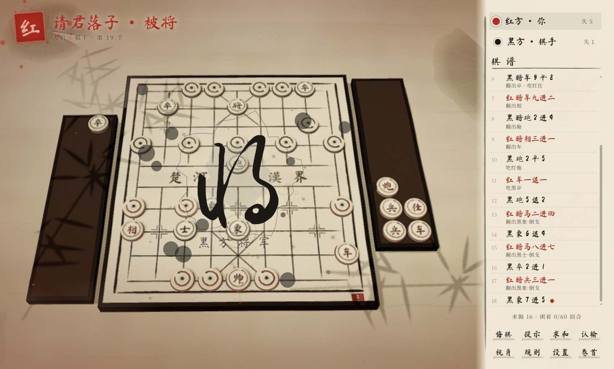
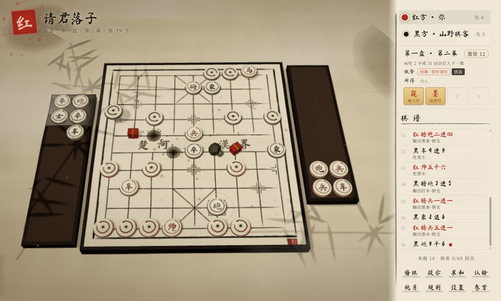
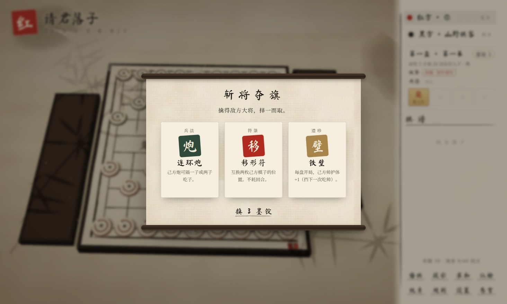
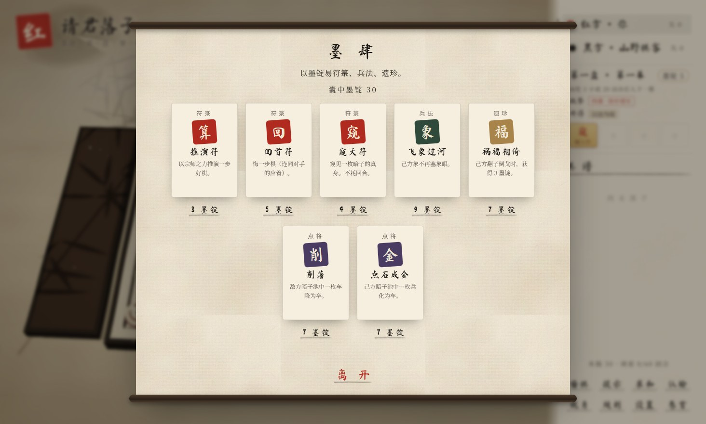
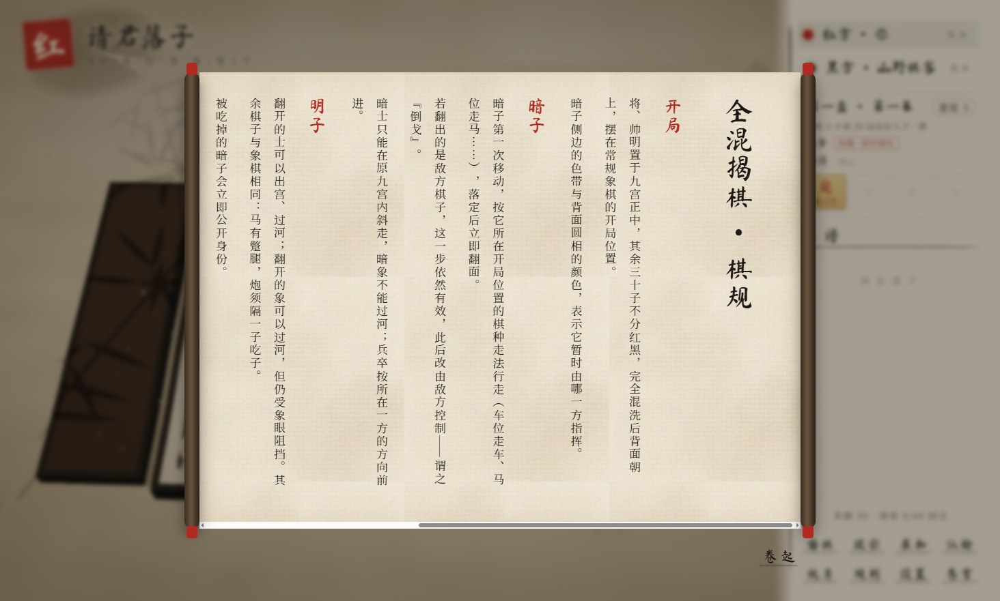

# 墨弈 · 全混揭棋

**中文** | [English](README.en.md)

水墨风 3D 全混揭棋桌面游戏（Windows）。基于 Three.js 渲染，用 Electron 打包。将帅明置于九宫正中，其余 30 子不分红黑完全混洗，背面朝上摆在开局位置，走一步翻一子。内含 Roguelike 模式「墨途闯关」。


## 截图

| 人机对弈 | 墨途闯关 |
|---|---|
|  |  |
| **斩将夺旗：三选一** | **墨肆：商店** |
|  |  |



## 下载

在本仓库的 [Releases](https://github.com/YOLOW92/moyi-jieqi/releases) 页面下载（仅 Windows x64）：

- **便携版**：`moyi-jieqi-<版本>-portable.exe`，双击即玩，无需安装。
- **安装版**：`moyi-jieqi-<版本>-setup.exe`，可以选择安装目录。

程序未做代码签名，首次运行时 Windows SmartScreen 可能提示“未知发布者”，点「更多信息 → 仍要运行」即可。也可以按下文「开发」一节从源码自行打包，产物在 `release/` 目录。

## 玩法

- **双人对弈**：同屏轮流走子，每回合镜头自动转到行棋方。
- **人机对弈**：初学、棋手、宗师三档。AI 只按公开信息推演，绝不偷看暗子。
- **墨途闯关**：Roguelike 模式，见下文。

### 全混揭棋规则

- 暗子第一次移动，按它所在开局位置的棋种走（车位走车、马位走马……），落定后立即翻面。
- 翻出敌方棋子时这一步依然有效，此后该子归敌方控制，谓之“倒戈”。
- 暗士只能在原九宫内斜走，暗象不能过河；翻开后士可出宫，象可过河。
- 吃掉对方将帅，或使轮到的一方无子可动，即为胜。同一局面第三次出现，或连续六十回合无吃子、无翻面，判和。

### 墨途闯关（Roguelike）

一次墨途共三盘，每盘分三幕，玩家执红对电脑。

- **换幕**：本盘吃满 3 子或走满 20 回合入第二幕，吃满 7 子或走满 40 回合入第三幕。每次换幕，敌方难度上升，盘上多出地形；第二幕加一条敌方词缀，第三幕首领登场。换幕后开一次墨肆（商店）。
- **墨锭**：吃敌子、翻出己方子、开宝匣都能得到，过盘另有奖励。
- **三选一**：吃掉敌方车、马、炮时，从兵法、遗珍、符箓中挑一张，也可以换成 3 墨锭。
- **兵法**（5 种）：改写己方走法，如马不蹩腿、炮可隔两子吃子。
- **遗珍**（8 种）：被动效果，如帅护体、开局窥见暗子。
- **符箓**（7 种）：一次性主动技，在侧栏点击使用：窥天、定身、移形、推演、回首、泼墨、开山。
- **点将**（3 种）：在墨肆购买，改写暗子池，如兵化为车、策反敌子。
- **地形**：山石不可进入，能挡路，也能当炮架；落入墨池的棋子下一回合不能走；宝匣踩上即得。
- **首领**：铁甲将军（护体 2）、御驾亲征（将出九宫）、墨魇（每六手唤回一枚阵亡敌子）。
- 墨途中不能悔棋、提示、求和，只能借符箓。AI 按同一套修正后的规则推演，仍然不偷看暗子。

## 操作

点击或拖拽己方棋子走子，右键取消选择。快捷键：

- `Ctrl+Z` 悔棋
- `H` 提示
- `F` 翻转视角
- `F1` 棋规
- `F11` 全屏
- `Esc` 取消选择或回到卷首

对局自动保存，下次启动可以从卷首继续。

## 动效一览

- **卷首**：镜头环绕山水，标题浓墨落纸并溅开墨花，印章盖下，按钮笔刷扫过。
- **开局**：棋盘线条逐笔写出，楚河汉界层层渗墨；棋子自天而降并荡开涟漪，将帅最后重落，迸出墨花。
- **选子**：棋子浮起摇曳、泛金光，脚下墨环扩散；可落之处墨点弹出，可吃之子套上旋转的朱砂圆相。
- **走子**：棋子沿弧线飞行并前倾，身后拖出墨痕，伴有风声；落定时压扁回弹、晕开涟漪、留下墨迹。
- **翻面**：暗子腾空翻转一周半，迸出金色碎光，画面闪白，古筝琶音响起。倒戈时墨色四溅，屏幕上写出草书“倒戈”。
- **吃子**：被吃的子被撞飞，空中翻面后落进阵亡托盘；墨滴四溅后在纸上留下渐淡的墨点，伴随墨烟、镜头震动和鼓声。
- **将军**：将帅脚下泛起朱砂墨晕，画面四周染红，草书“将”字落下，锣鼓齐鸣。
- **回合交替**：印章盖下，行棋一方的棋子依次轻跳，如水波掠过。
- **AI 思考**：候选棋子微微浮起，淡墨箭头一闪而过，然后拈子落下。
- **终局**：墨花迸发，落梅骤起，镜头缓缓环绕；输棋时画面褪色；结算对话框以卷轴形式展开。
- **环境**：三层远山、红日、飘雾、落梅、盘旋的仙鹤；竹影随阵风摇曳，投在棋盘上；四周是荷塘。
- **界面**：笔锋光标会拖出墨迹，点击处溅开墨花，场景切换用墨染转场；棋谱逐条刷出，规则以竖排卷轴展开。

## 开发

需要 Node.js 20.19+ 或 22.12+。

```powershell
npm install
npm run dev      # 浏览器调试（Vite）
npm start        # 构建后用 Electron 启动
npm test         # 规则、AI 与墨途单元测试（Vitest）
npm run dist     # 打包 exe 到 release/
```

### 结构

| 目录 | 内容 |
|---|---|
| `src/core` | 规则引擎 `rules.ts`（纯函数，可在 Worker 中运行，含墨途的规则修正）与记谱 `notation.ts` |
| `src/ai` | 公平 AI：只按公开信息重采样暗子，迭代加深 α-β 加静态吃子搜索，在 Web Worker 中运行 |
| `src/rogue` | 墨途闯关：内容定义、局外状态、流程导演 |
| `src/scene` | 3D 场景：渲染舞台与水墨后期、棋盘笔绘、棋子、特效、地形、山水环境、程序化纹理 |
| `src/ui` | 卷首、对局面板、大字横幅、卷轴对话框、墨途卡牌与商店、2D 墨迹层 |
| `src/audio` | Web Audio 实时合成音效（木子、古筝、鼓、锣、松风） |
| `src/game` | 对局控制器：串联规则、AI、动画、界面与存档 |
| `electron` | 桌面外壳 |

## 许可证

本项目以 [GNU GPL-3.0](LICENSE) 发布。你可以自由使用、修改和再发布，但发布修改版时也须以 GPL-3.0 开源。

所用字体（马善政、刘建毛草、思源宋体，经 Fontsource 引入）均为 SIL Open Font License。
